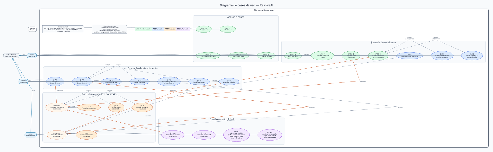

# Diagrama de casos de uso do ResolveAí

Este documento apresenta a visão funcional completa planejada para o ResolveAí e separa claramente o que já foi entregue na AC1 do que pertence às próximas etapas. Casos planejados representam a visão do produto, não funcionalidades disponíveis na versão atual.



Arquivos para apresentação:

- [SVG vetorial](diagrama-casos-de-uso.svg), recomendado para slides por manter a nitidez ao ampliar;
- [PNG em alta resolução](diagrama-casos-de-uso.png);
- [fonte Graphviz](diagrama-casos-de-uso.dot), usada para atualizar o desenho.

## Legenda das entregas

| Cor | Etapa | Situação |
| --- | --- | --- |
| Verde | AC1 | Implementada e validada |
| Azul | AC2 | Planejada: operação de atendimento |
| Laranja | AC3 | Planejada: consulta avançada e auditoria |
| Roxo | Entrega final | Planejada: gestão e visão operacional |

## Atores e responsabilidades

### Visitante

- cadastrar-se, sempre recebendo o perfil `SOLICITANTE`;
- autenticar-se com e-mail e senha.

### Usuário autenticado

`Solicitante`, `Atendente` e `Administrador` são especializações deste ator e compartilham os casos de consultar a própria conta, alterar o próprio nome e encerrar a sessão. Autenticação e autorização são pré-condições dos casos protegidos, não casos incluídos repetidamente no diagrama.

### Solicitante

- abrir chamado escolhendo uma categoria ativa;
- consultar somente os próprios chamados e seus detalhes;
- adicionar comentários;
- confirmar uma resolução, levando o chamado a `FECHADO`;
- solicitar reabertura com justificativa, retornando o chamado a `EM_ATENDIMENTO`.

### Atendente

- consultar a fila e os detalhes que estiver autorizado a visualizar;
- assumir chamado, alterando-o de `ABERTO` para `EM_ATENDIMENTO`;
- alterar prioridade;
- adicionar comentários;
- registrar a solução e resolver chamados sob sua responsabilidade.

O endpoint de verificação de perfil existente na AC1 é uma prova técnica de autorização e, por isso, não aparece como objetivo de negócio no diagrama.

### Administrador

- consultar chamados globalmente e acompanhar o dashboard operacional;
- administrar usuários: listar, consultar, alterar nome, e-mail e perfil, ativar e desativar;
- administrar categorias: listar, criar, alterar, ativar e desativar;
- consultar histórico dentro da visibilidade administrativa.

Administrador e atendente são perfis distintos. O diagrama não pressupõe que o administrador execute automaticamente ações operacionais do atendente.

## Relações importantes

- **Abrir chamado** inclui consultar categorias ativas, pois uma categoria válida é obrigatória.
- **Resolver chamado** inclui registrar a solução.
- Os casos concretos de listagem e detalhe especializam consultas autorizadas abstratas, preservando a visibilidade de cada perfil.
- Comentar, assumir, alterar prioridade, confirmar resolução e solicitar reabertura são extensões condicionais da consulta de um detalhe autorizado.
- Pesquisa e filtros estendem uma listagem autorizada; paginação e ordenação são incluídas nessa listagem; o histórico estende um detalhe autorizado.

## Regras de domínio representadas

```text
ABERTO → EM_ATENDIMENTO → RESOLVIDO → FECHADO
                    ↑             |
                    └── reabrir ──┘
```

- todo chamado nasce `ABERTO`, sem atendente;
- somente o atendente responsável resolve o chamado;
- a reabertura exige justificativa;
- `FECHADO` é um estado terminal nesta versão;
- mudanças de status, prioridade e responsável são auditáveis;
- comentários são imutáveis;
- usuários e categorias referenciados são desativados, nunca excluídos fisicamente.

## Fora do escopo atual

Não fazem parte desta visão, salvo solicitação futura explícita: anexos, notificações em tempo real, recuperação de senha, login social, SLA, chat externo, microsserviços e integrações de terceiros.

## Como explicar na apresentação

1. Comece pelos atores à esquerda e esclareça que cada perfil possui uma visão autorizada diferente.
2. Mostre em verde o fluxo já demonstrável da AC1: cadastro, login, conta, abertura e acompanhamento próprio.
3. Siga o ciclo do chamado: o solicitante abre, o atendente assume e resolve, e o solicitante confirma ou pede reabertura.
4. Explique que AC3 acrescenta capacidade de consulta e auditoria, sem mudar as regras de visibilidade.
5. Termine com a visão administrativa da entrega final e destaque a exclusão lógica para preservar o histórico.
