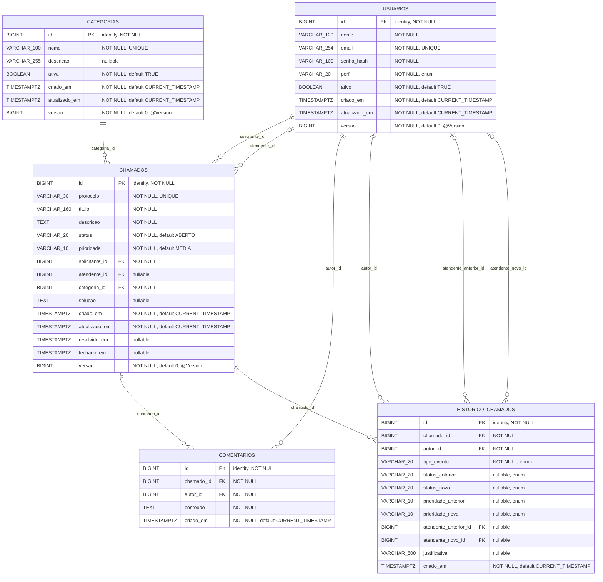

# Modelo entidade-relacionamento

Este documento descreve o schema criado pelas migrations Flyway. A V1 cria o modelo relacional e a V2 exige que e-mails de usuário sejam armazenados normalizados. As entidades em foco são `USUARIOS`, `CATEGORIAS` e `CHAMADOS`; `COMENTARIOS` e `HISTORICO_CHAMADOS` também aparecem porque fazem parte do modelo persistido e das relações de auditoria.

## Diagrama

No bloco Mermaid, `TIMESTAMPTZ` é o nome curto usado para o tipo PostgreSQL `TIMESTAMP WITH TIME ZONE` da migration. Os tamanhos (`VARCHAR_120`, por exemplo) são rótulos visuais para os `VARCHAR(n)`; a definição normativa é a migration V1.

## Chaves, cardinalidades e integridade

- Todas as tabelas têm uma chave primária `id BIGINT GENERATED BY DEFAULT AS IDENTITY`.
- `chamados.solicitante_id` é obrigatório: cada chamado tem exatamente um solicitante, enquanto um usuário pode ter zero ou muitos chamados. A FK não verifica se o perfil do usuário é `SOLICITANTE`; essa autorização é responsabilidade do back-end.
- `chamados.atendente_id` é opcional: um chamado pode nascer sem atendente e, quando preenchido, referencia um usuário. A FK não verifica o perfil `ATENDENTE`; a regra de atribuição fica no serviço.
- `chamados.categoria_id` é obrigatório: cada chamado referencia uma categoria e uma categoria pode ser usada por zero ou muitos chamados. Na abertura, o back-end deve aceitar somente categoria existente e `ativa = TRUE`. A migration não consegue garantir a condição temporal “ativa no momento da abertura” com a FK; a categoria pode ser desativada depois sem invalidar chamados já existentes.
- Cada comentário pertence a exatamente um chamado e tem exatamente um autor. Cada evento de histórico pertence a um chamado e tem exatamente um autor.
- `atendente_anterior_id` e `atendente_novo_id` são FKs opcionais independentes para `usuarios`; ficam nulos quando o evento não registra aquele lado da atribuição.
- As FKs foram declaradas sem `ON DELETE`: prevalece o comportamento padrão `NO ACTION`. Portanto, registros referenciados não podem ser apagados fisicamente sem antes remover referências. Isso apoia a exclusão lógica por `usuarios.ativo` e `categorias.ativa`.

### Unicidade e checks

Há unicidade em `usuarios.email`, `categorias.nome` e `chamados.protocolo`. Antes de acrescentar `ck_usuarios_email_normalizado`, a V2 normaliza os e-mails já existentes com `LOWER(TRIM(email))`; combinada à unicidade da V1, a constraint elimina diferenças de caixa e espaços externos. Se dados antigos contiverem duas versões do mesmo e-mail que colidam após a normalização, a migration falha de forma atômica para que o conflito seja resolvido explicitamente. Os demais `CHECK`s da V1 são:

- `usuarios.perfil`: `SOLICITANTE`, `ATENDENTE` ou `ADMIN`; nome e e-mail não podem ser vazios após `TRIM`.
- `categorias.nome` não pode ser vazio após `TRIM`.
- `chamados.status`: `ABERTO`, `EM_ATENDIMENTO`, `RESOLVIDO` ou `FECHADO`; `prioridade`: `BAIXA`, `MEDIA` ou `ALTA`; título e descrição não podem ser vazios após `TRIM`.
- Um chamado em `RESOLVIDO` ou `FECHADO` precisa ter `resolvido_em`; um chamado em `FECHADO` precisa ter `fechado_em`. A V1 não exige o inverso (não proíbe uma data em outro status).
- `comentarios.conteudo` não pode ser vazio após `TRIM`.
- `historico_chamados.tipo_evento`: `CRIACAO`, `ATRIBUICAO`, `STATUS` ou `PRIORIDADE`. Os campos de status e prioridade, quando não nulos, devem usar os mesmos valores enumerados acima.

## Datas, versão e índices

Todos os timestamps da V1 são `TIMESTAMP WITH TIME ZONE NOT NULL DEFAULT CURRENT_TIMESTAMP`, exceto `resolvido_em` e `fechado_em`, que são opcionais. No PostgreSQL, esse tipo representa um instante normalizado e não preserva o identificador do fuso originalmente informado; a API deve serializar e receber esses valores em ISO 8601 UTC, por exemplo `2026-09-08T12:00:00Z`. A V1 não fixa o fuso da sessão do PostgreSQL nem cria triggers para atualizar `atualizado_em`; o serviço deve manter esse campo correto.

`usuarios.versao`, `categorias.versao` e `chamados.versao` são `BIGINT NOT NULL DEFAULT 0` e estão mapeados para controle otimista de versão com `@Version`. `comentarios` e `historico_chamados` não possuem coluna `versao`, pois são registros imutáveis na versão atual. A coluna e o mapeamento JPA precisam ser usados dentro das transações de atualização para detectar conflitos concorrentes.

Índices criados pela V1:

| Índice | Colunas | Uso esperado |
| --- | --- | --- |
| `idx_chamados_solicitante_criado_em` | `chamados(solicitante_id, criado_em)` | chamados do solicitante, ordenados por criação |
| `idx_chamados_atendente_status` | `chamados(atendente_id, status)` | fila por atendente e status |
| `idx_chamados_status_prioridade_criado_em` | `chamados(status, prioridade, criado_em)` | fila filtrada por status/prioridade |
| `idx_chamados_categoria_status` | `chamados(categoria_id, status)` | filtros de categoria e status |
| `idx_comentarios_chamado_criado_em` | `comentarios(chamado_id, criado_em)` | comentários cronológicos por chamado |
| `idx_historico_chamado_criado_em` | `historico_chamados(chamado_id, criado_em)` | histórico cronológico por chamado |

As constraints `UNIQUE` também criam índices únicos no PostgreSQL. Não há índices adicionais nem colunas para anexos, notificações ou outros módulos fora do escopo da V1.

## Limites do que o schema garante

O banco garante tipos, nulabilidade, unicidade, valores enumerados, relações e alguns requisitos de datas. Ele não garante, sozinho, que o solicitante seja o usuário autenticado, que o atendente tenha perfil correto, que usuários/categorias estejam ativos, que as transições de status sejam válidas, que comentários sejam autorizados para aquele ator ou que alteração e histórico sejam gravados na mesma transação. Essas regras devem permanecer no Spring Boot, com autorização no servidor e auditoria transacional.
